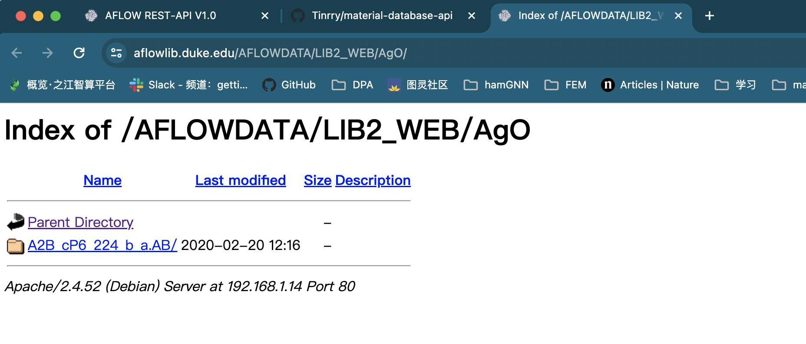

## information
## OQMD
- OK, download by yang, need mysql service .

## AFLOW
DISCLAIMER

The data included within the aflow.org repository is free for scientific, academic and non-commercial purposes. Any other use is prohibited.
AFLOW and AFLOWLIB.ORG come with ABSOLUTELY NO WARRANTY, to the extent permitted by applicable law.

整体的数据集索引

https://aflowlib.duke.edu/AFLOWDATA/LIB2_WEB/

获取该网站数据集的方法：
1. 从一级目录  https://aflowlib.duke.edu/AFLOWDATA/LIB2_WEB/  获取所有材料的元素，保存在aflowlib-lib2-1706.csv.
2. 从第一步获取1706个二级目录的链接,记录每个元素的所有具体材料网页的链接，比如3-AgAl-1057.csv, 表示元素比如AgAl有1057个材料页面。
3. 下载材料页面，比如3-AgAl-1057.csv，有1057个html网页。其中一个页面示例为：AgAl-1.html
   
从这里我们可以算出，一个页面26k * 1000000 = 26G 文件大小

相关文件在文件夹aflowlib中，完整数据集在dataset中（local）

## 备注
url = https://aflowlib.duke.edu/AFLOWDATA/LIB2_WEB/./AgAl/

末尾必须要有/


## 拓展
1. mpi 并行等等，后续有需要再考虑。
2. 断点续传，后续考虑。

## 特殊样例
第32行：
https://aflowlib.duke.edu/AFLOWDATA/LIB2_WEB/./AgO/



该元素就一个材料页面：
https://aflowlib.duke.edu/AFLOWDATA/LIB2_WEB/AgO/A2B_cP6_224_b_a.AB/

解决方法：

1. 手动下载，存放在 aflowlib/except-sample/
2. 将这个条目从aflowlib-lib2-1706.csv中删除
3. download.py，从中断的url继续下载继续下载。
   ```
   for material_link in urls_file.readlines()[31:]:            # 因为AgO中断了，所以手动从这里继续下载    
      pass   
   ```

## ToDo

1. 定时查看程序是否中断了。

## NOMAD
   [学习链接](https://www.nomad-coe.eu/events2/course-on-big-data-and-artificial-intelligence/exercise-1)

   是AFLOW的子集
   
   使用方法见nomad.ipynb

   数据未下载

## materialproject

   ToDo

